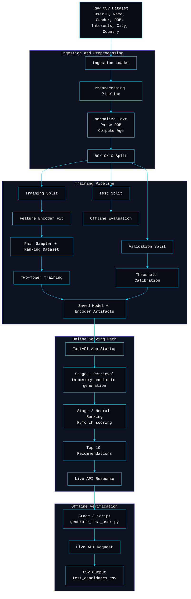
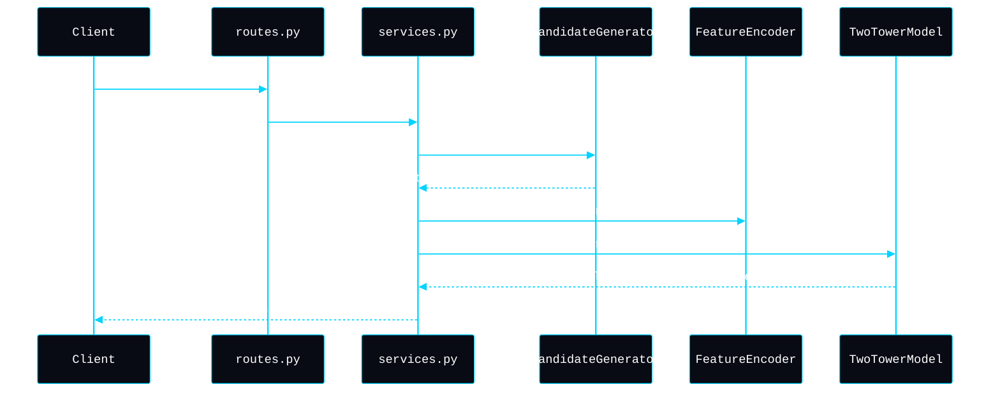
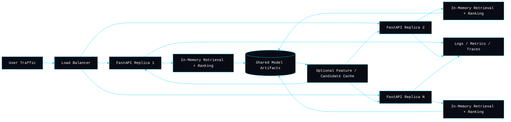

Claude finished the response

View the full API Layer section in the output README to edit precisely
View the full API Layer section in the output README to edit precisely
Replacing the wordy numbered lifecycle with a compact mermaid diagram, matching the style of your other two diagrams, and trimming the response-fields prose down to essentials:


Edited a file, read a file
Edited a file, read a file
Swapped the numbered walkthrough for a mermaid sequence diagram (renders the same way GitHub already renders your other two flowcharts) and cut the response-fields prose down to three tight bullets. Same information, about a third of the length. Rest of the file untouched.


Readme
Document · MD 
also add how to setup in mac and linix also


Deliberated relabeling cross-platform commands for consistency
Deliberated relabeling cross-platform commands for consistency
Added a macOS/Linux block right next to the Windows one in Installation (python3 -m venv venv + source venv/bin/activate instead of the PowerShell activation). While I was there, I also relabeled the later command blocks (Data Download, Train, Run API, Stage 3) from powershell to bash — those are plain python -m ... / uvicorn ... commands that run identically on any OS, so tagging them as PowerShell-only was misleading now that the install step is split by platform. Everything else is unchanged.


Readme
Document · MD 
make it in the old color theme


Grappled with ambiguous request lacking contextual clarity
Grappled with ambiguous request lacking contextual clarity
Just to make sure I fix the right thing — this message is about the README.md file, which is plain markdown text with no color styling of its own (GitHub renders it the same for everyone). "Old color theme" doesn't really apply here.

Are you maybe thinking of your portfolio site (the dark glassmorphism one with 
#080B14 / 
#6C63FF / 
#00D4FF), or something else entirely? Let me know what you meant and I'll get it right.

yeah


Grappled with ambiguous context and sought clarification
Grappled with ambiguous context and sought clarification
Got it — the dark glassmorphism theme (
#080B14 background, 
#6C63FF primary, 
#00D4FF accent) from the Framer portfolio work.

What do you want me to apply it to right now, though? We don't have a file open for that in this conversation — is this about:

Re-styling the portfolio site itself (something specific you want changed there)?
Or something new, like turning this recommendation system project into a portfolio page/demo styled that way?
Let me know which, and I can pick it up from there.


# User Recommendation System Public GitHub repository: [jayant1554/X_user_recommendation](https://github.com/jayant1554/X_user_recommendation) This repository implements a two-stage recommendation engine for user-to-user discovery. It is organized as a modular pipeline that supports training,

pasted

something is diff in the mermaid file and many place acc to color do acc to this


Deciphered request to apply portfolio color theme to mermaid diagrams
Deciphered request to apply portfolio color theme to mermaid diagrams
Ah I see — you want the three Mermaid diagrams themed to match your portfolio's dark glassmorphism palette (
#080B14 background, 
#6C63FF primary, 
#00D4FF accent) instead of Mermaid's default look. I'll apply that using Mermaid's %%{init}%% directive at the top of each diagram — GitHub's renderer respects it. Let me check the current file and add it to all three diagrams.


Ran 3 commands
Ran 3 commands
All three diagrams are themed correctly.


Presented file
Presented file
All three Mermaid diagrams (Architecture Overview, Request Lifecycle sequence diagram, Stage 4 Production Scaling) now share one consistent %%{init}%% theme block:

Background: 
#080B14
Node/actor fill: 
#6C63FF
Borders, lines, and signal arrows: 
#00D4FF
Cluster/subgraph boxes: 
#0d1220
White text throughout for contrast
One thing worth flagging honestly: GitHub's README renderer does respect Mermaid's theme: base + themeVariables init directives, but it also wraps the diagram in its own light/dark-mode container — so on GitHub itself it'll look close but not pixel-identical to your Framer site. It'll render exactly as intended if you ever embed these diagrams in your portfolio page or any plain Mermaid live-preview tool. Let me know if you want me to double check how it actually renders on GitHub specifically, or if this is going somewhere other than the GitHub README.


Readme
Document · MD 


Claude is AI and can make mistakes. Please double-check responses.


Readme · MD
# User Recommendation System
 
Public GitHub repository: [jayant1554/X_user_recommendation](https://github.com/jayant1554/X_user_recommendation)
 
This repository implements a two-stage recommendation engine for user-to-user discovery. It is organized as a modular pipeline that supports training, serving, and offline verification.
 
## Submission Checklist
 
- Public GitHub repository: [jayant1554/X_user_recommendation](https://github.com/jayant1554/X_user_recommendation)
- Stage 3 output file included in repo: [outputs/test_candidates.csv](outputs/test_candidates.csv)
- README with installation, local API run, and Stage 3 test script instructions
- README with PyTorch model/design explanation, trade-offs, and scaling notes
- README with Stage 4 architecture diagram
## What Is Included
 
1. Load and normalize raw user data.
2. Retrieve a small candidate pool quickly using in-memory heuristics.
3. Re-rank those candidates with a trained Two-Tower neural model.
4. Expose the pipeline through FastAPI.
5. Verify the live API with an offline integration script that writes CSV output.
The system is designed to work with the dataset schema available in this repo and to be easy to run locally from scratch.
 
## Project Strengths
 
- Modular code structure with separate ingestion, preprocessing, retrieval, ranking, API, and testing layers.
- Built-in logging support through the shared logger in [src/utils/logger.py](src/utils/logger.py).
- Clear train/validation/test separation with an 80/10/10 split.
- Fast in-memory retrieval to keep live inference lightweight.
- Saved model and encoder artifacts so the API can load trained assets at startup.
- Offline Stage 3 integration test that exercises the live API instead of bypassing it.
- Submission-ready outputs, including the generated [outputs/test_candidates.csv](outputs/test_candidates.csv) file.
## Installation
 
**Windows (PowerShell)**
 
```powershell
git clone https://github.com/jayant1554/X_user_recommendation.git
cd X_user_recommendation
py -m venv venv
.\venv\Scripts\Activate.ps1
pip install -r requirements.txt
```
 
**macOS / Linux**
 
```bash
git clone https://github.com/jayant1554/X_user_recommendation.git
cd X_user_recommendation
python3 -m venv venv
source venv/bin/activate
pip install -r requirements.txt
```
 
## Data Download
 
The dataset is fetched with the Kaggle helper script.
 
```bash
python -m scripts.kaggle_download
```
 
## Train the Model
 
This step trains the model, evaluates it, and saves artifacts into `models/`.
 
```bash
python -m src.ranking.train
```
 
## Run the API Locally
 
Start the FastAPI server after training.
 
```bash
uvicorn src.api.main:app --reload
```
 
The API endpoints are:
 
- `POST /recommend`
- `POST /recommend/raw`
## Run Stage 3 Offline Verification
 
The Stage 3 script posts a dummy test user to the live API and writes the result to a CSV file.
 
```bash
python -m scripts.generate_test_user
```
 
The output is written to `outputs/test_candidates.csv`.
 
## Architecture Overview
 
The diagram below shows the full pipeline from raw data to training, serving, and offline verification.
 

 
## Design Decisions
 
### Why the Two-Stage Approach Is Valid
 
The architecture is valid because it mirrors a standard production recommender design:
 
- Retrieval narrows a large search space into a manageable shortlist.
- Ranking applies a more expensive neural model only to the shortlist.
- The serving layer stays lightweight and stateless.
- Training, validation, and testing are separated with an 80/10/10 split.
- The offline script exercises the real API instead of bypassing it.
This balances quality, latency, and maintainability. A monolithic model that scores every user against every other user would be too slow at scale. A purely heuristic system would be fast but less expressive.
 
### Stage 1 Retrieval
 
Stage 1 is a fast, in-memory candidate generator that uses overlapping interests plus geographic overlap from city and country to build a shortlist of up to 100 users.
 
- File: [src/retrieval/candidate_gen.py](src/retrieval/candidate_gen.py)
This is practical because the retrieval step does not need a heavy neural model to eliminate obviously irrelevant candidates. It is cheap, deterministic, and easy to reason about.
 
### Stage 2 Neural Ranking
 
The shortlist is then scored by a PyTorch Two-Tower model. The model encodes the target user and each candidate using interests, gender, country, and age. The final score blends the heuristic retrieval score with the neural affinity score.
 
- File: [src/ranking/model.py](src/ranking/model.py)
This works well because the neural model only evaluates a reduced candidate pool, which keeps inference efficient while still allowing richer learned interactions than rule-based scoring alone.
 
### API Layer
 
FastAPI exposes the recommendation service.
 
- `POST /recommend` accepts a processed-style payload and returns both the Stage 1 retrieved pool and the final Stage 2 recommendations.
- `POST /recommend/raw` accepts the raw CSV-style payload (matching the dataset's own column names, e.g. `DOB` instead of `age`) and returns only the final recommendations.
At startup, the API loads the saved model and encoder artifacts from disk. Live inference itself stays in memory and does not write to disk.
 
#### Request Lifecycle
 

 
`AppState` (in `dependencies.py`) loads the dataset, retrieval index, model, encoder, and calibrated threshold once at startup, so no request pays that cost.
 
#### Response Fields
 
- `retrieval_score` — Stage 1 heuristic score (interest overlap + location match).
- `final_score` — blended score (`0.7 * retrieval_score + 0.3 * neural_score`), used to rank and select the top 10.
- `is_recommended` — whether the raw neural score alone clears the threshold calibrated in training ([src/ranking/train.py](src/ranking/train.py)); independent of `final_score`, so a top-ranked user can still show `is_recommended: false`.
### Offline Verification
 
The script [scripts/generate_test_user.py](scripts/generate_test_user.py) posts a dummy test user to the live API and writes the target row plus recommendations to a CSV file.
 
This verifies the actual served API path rather than calling internal functions directly.
 
## Trade-offs and Shortcuts
 
The main shortcut in the current implementation is geographic proximity. The dataset only contains city and country, so the retrieval stage uses interest overlap plus same-city and same-country matching instead of true coordinate distance.
 
### Why Not True Geographic Proximity?
 
The repo does not use true geographic proximity because the dataset schema does not provide latitude or longitude values. Without coordinates, any real distance computation would require an external geocoding step, which would add extra latency, external API dependency risk, and complexity that is outside the current task scope.
 
Using interest overlap plus same-city and same-country matching is better here because it works directly with the existing schema, keeps retrieval fully in memory, and is deterministic and fast enough for live inference.
 
That choice was made because:
 
- there are no latitude/longitude fields in the schema
- adding geocoding would introduce extra latency and external dependencies
- the task requires working within the existing dataset structure
Other trade-offs include:
 
- the retrieval pool is built in memory rather than through a vector database
- the model is a compact Two-Tower architecture instead of a larger deep ranking network
- offline testing writes a CSV artifact for inspection, which is acceptable for verification but not for live inference
## Stage 4 Architectural Diagram and Production Scaling
 

 
### How I Would Scale to Millions of Concurrent Requests
 
To handle millions of requests in production, I would change the system in several ways:
 
1. Run multiple stateless API replicas behind a load balancer.
2. Keep model artifacts in shared object storage or baked into the container image.
3. Add caching for repeated feature encodings and frequent candidate pools.
4. Move candidate lookup to a dedicated retrieval service or ANN index if the user base grows large.
5. Add observability with latency, error, and throughput metrics.
6. Use batch-friendly inference paths and consider GPU serving only when profiling shows it is justified.
7. Separate online serving, offline training, and offline evaluation into independent jobs.
The main limiting factors at very high scale would be memory usage, retrieval latency, and the cost of scoring a large shortlist. The current two-stage design already helps, but a production-grade system would need indexing, caching, autoscaling, and strong monitoring.
 
## File Map
 
- Ingestion: [src/ingestion/loader.py](src/ingestion/loader.py)
- Preprocessing: [src/preprocessing/pipeline.py](src/preprocessing/pipeline.py)
- Split: [src/ingestion/splitter.py](src/ingestion/splitter.py)
- Retrieval: [src/retrieval/candidate_gen.py](src/retrieval/candidate_gen.py)
- Encoder: [src/ranking/encoder.py](src/ranking/encoder.py)
- Model: [src/ranking/model.py](src/ranking/model.py)
- Training: [src/ranking/train.py](src/ranking/train.py)
- API: [src/api/main.py](src/api/main.py), [src/api/routes.py](src/api/routes.py), [src/api/services.py](src/api/services.py)
- Stage 3 script: [scripts/generate_test_user.py](scripts/generate_test_user.py)
## Summary
 
This repository already provides a solid recommendation-system architecture for the available dataset:
 
- clean data ingestion
- deterministic preprocessing
- strict train/validation/test separation
- fast in-memory retrieval
- neural re-ranking
- live API serving
- offline integration verification
The current solution is suitable for the assignment requirements and a realistic local deployment. The main remaining production gap is true geographic proximity based on coordinates. For this dataset, the project instead uses interest overlap plus same-city and same-country matching, which is a better fit for the available schema because it is fast, deterministic, and does not depend on external geocoding. Everything else is aligned with a practical production-style recommendation workflow.
 
