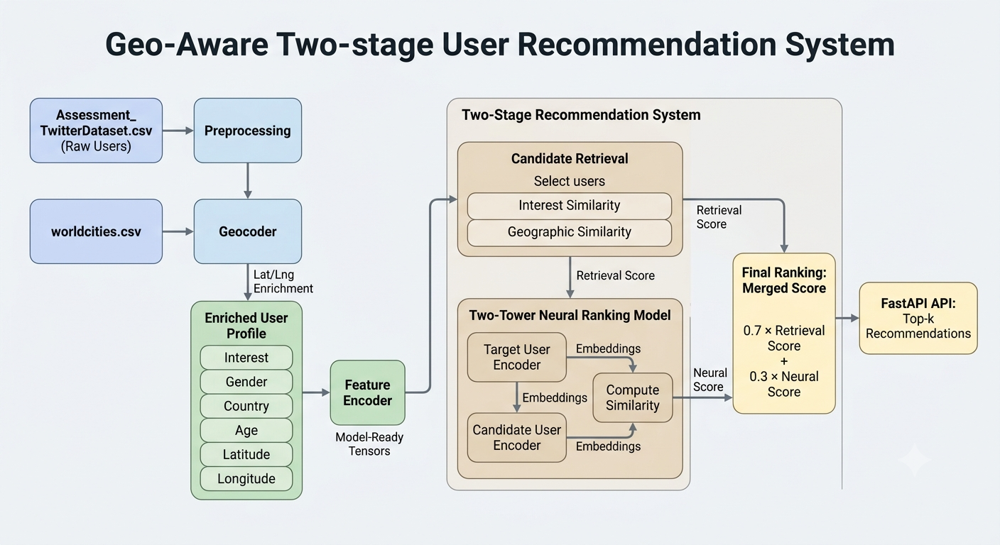
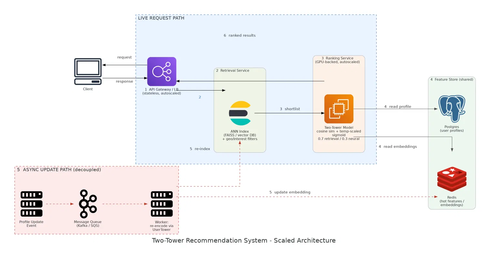

# X User Recommendation

This project is a geo-aware, two-stage recommendation system for user discovery. The idea is to narrow the candidate pool quickly with a simple heuristic and then use a trained model to re-rank the most likely matches more carefully.

The main upgrade in this version is that location is now part of the recommendation signal. The dataset includes city and country information, but not latitude and longitude, so I added a geocoding step using the worldcities reference file to attach real coordinates. After preprocessing, the system retrieves a smaller set of potential users using interest overlap and geographic closeness, then re-ranks them with a Two-Tower PyTorch model. The final recommendation score blends the retrieval score and the neural score, which keeps the pipeline fast while still letting the model learn richer user-to-user relationships.
 
In this README, I will explain how to set up the project, describe the architecture, and summarize the design choices made along the way.

## Setup instructions

### 1. Clone and install

**Windows (PowerShell)**

```powershell
git clone https://github.com/jayant1554/X_user_recommendation.git
cd X_user_recommendation
py -m venv venv
.\venv\Scripts\Activate.ps1
pip install -r requirements.txt
```

**macOS / Linux**

```bash
git clone https://github.com/jayant1554/X_user_recommendation.git
cd X_user_recommendation
python3 -m venv venv
source venv/bin/activate
pip install -r requirements.txt
```

### 2. Optional: Prepare CSV data if missing

If the CSV data is not present, run the Kaggle download script first:

```bash
python scripts/kaggle_download.py
```

If `data/processed/geouser.csv` is still not present, generate it with:

```bash
python geotest.py
```

### 3. Train the model

```bash
python -m src.ranking.train
```

This loads the dataset, preprocesses the users, fits the encoder, trains the ranking model, evaluates it, and saves the artifacts into the models folder.

### 4. Run the API locally

```bash
uvicorn src.api.main:app --reload
```

Then open:

- http://127.0.0.1:8000/docs

Endpoints:

- POST /recommend
- POST /recommend/raw

### 5. Run the offline verification script

```bash
python -m scripts.generate_test_user
```

This calls the live API with a sample user and writes the result to the outputs folder.

## Architecture overview

This is the flow the project follows.



## How the geo-location was added
The raw file in data/raw/Assessment_TwitterDataset.csv contains things like UserID, Name, Gender, DOB, Interests, City, and Country, but it does not include latitude and longitude. That means the original data is not enough for the required recommendation system.

To fix that, I used the world cities dataset in data/raw/worldcities.csv as the reference source and added a geocoding layer in geotest.py. The logic normalizes city and country names, matches them to the reference dataset(assisment dataset) and attaches the closest known latitude and longitude values.

It tries a few levels of fallback so the system can still work when names are slightly inconsistent:

1. exact city + country match
2. city-only fallback
3. country capital fallback
4. no match found

By this i dropped the number of users that could not be matched from 24% to less than 0.17%. The final output is saved in data/processed/geouser.csv.
Once coordinates are attached, the system can do more than just compare interests. It can also score users by geography and prefer nearby users in the final ranking.

This is a meaningful improvement for a user-discovery model because people who are physically close and share similar interests are usually more relevant than people who only match on interest tags.


## System flow

The system follows a practical recommendation pipeline:

1. retrieve a smaller set of promising users quickly
2. re-rank that set with a learned model
3. return the best results through the API

This design keeps the first stage cheap and fast, while the second stage adds more value without evaluating every user in the dataset.

## Retrieval stage

The retrieval logic lives in src/retrieval/candidate_gen.py. It builds a candidate pool using in-memory indexes for interest overlap and geography. The score is intentionally simple and explainable:

- interest similarity
- geographic proximity
- weighted combination of both (`interest_weight * 0.7 + location_weight * 0.3`)

This stage is designed to be fast and cheap, so it can quickly narrow the candidate pool to a manageable size for the ranking model. It does not need to be perfect, just good enough to reduce the number of candidates.

This stage reduces the number of candidates the neural model has to consider, which is useful for keeping the process efficient on a dataset of this size.

## Pair sampling for training

The pair sampler in `src/ranking/pair_sampler.py` creates positive and negative examples for the model. A positive pair is one that is close in both interest and location, while negative pairs are sampled from users who do not meet that condition.

With the pair sampler, the model can learn to distinguish between users who are similar and those who are not, which improves the quality of the recommendations.
Without this step, the model would not have enough training data to learn meaningful relationships between users.
## Model Architecture & Design Decisions
two-tower (Siamese) neural model with shared weights.A single `UserTower` encodes both the target user and each candidate independently mean-pooled interest embeddings + gender/country embeddings + raw scalar features (age, lat, lng) → small MLP → fixed-size embedding. Embeddings are compared via cosine similarity, scaled by a learned temperature, then passed through a sigmoid to get a match probability.

why two-tower, not a joint MLP:the two "sides" being compared (target user, candidate user) share an identical feature schema, so a single shared encoder is enough, no need to learn two separate towers. More importantly, because the model never mixes target and candidate features before encoding, candidate embeddings can be precomputed and reused across every query. A joint model would require a full forward pass per (target, candidate) pair at inference, which doesn't scale past a few hundred candidates.

Why tiered retrieval instead of full kNN over all users: running the neural model against every user in the database is wasteful when most candidates are obviously irrelevant (different country, no shared interests). Retrieval narrows the candidate pool cheaply first (same-city → same-country → global) using Jaccard interest overlap and geography, and only the surviving candidates get scored by the neural model. It makkes inference cheap without sacrificing recall for the users most likely to be good matches.

## Trade-offs and constraints

Some Trade-offs and constraints that influenced the design:
- I have used worldcities.csv as a reference for geocoding, which is not perfect but good enough for this project. we could have used a paid geocoding API for more    accurate results, but that would have added complexity and cost.
- I have used the adam optimizer with BCE loss was choosen for fast, low-tuning convergence given the timeline, and not benchmarked against alternatives (e.g. SGD with momentum, which can generalize better with a tuned LR schedule but needs more epochs and tuning effort than was practical here).
- I have went with a negative sampling ratio of 2 negatives per positive, which was fixed as a starting default and not tuned a proper sweep (e.g. 4–10 negatives per positive) would likely sharpen the model's decision boundary, but wasn't prioritized given time.
- Production concerns like distributed serving, caching, and large-scale retrieval were not the main priority for this assignment

## Scaling Proposal (Stage 4)



Right now everything runs in one process users in memory, retrieval done with simple tiered filtering (same-city → same-country → global), and the two-tower model scoring candidates in a single batched matmul. Fine for this dataset, but it wouldn't survive real production load. Here's how I'd scale each piece:

Feature store. Move users and features out of memory into Postgres/DynamoDB for profiles and Redis for hot lookups  the API shouldn't be holding the whole user table in RAM.

Retrieval → real ANN index. The city → country → global tiering is basically a manual approximation of nearest-neighbor search. I'd replace it with FAISS or a managed vector DB, indexing embeddings from `UserTower.encode()`, with geo/interest as filters inside the query instead of sequential fallback tiers.

Ranking as its own service. Since candidate embeddings are precomputed and the target only needs encoding once per request, ranking doesn't need to live with the API. I'd split it into its own GPU-backed inference service (TorchServe or a FastAPI microservice) so it scales independently.

Cache candidate embeddings. They don't change unless the profile does, so precompute once and cache them rather than recomputing on every request probably the biggest latency win at scale.

Async profile updates.Re-embedding and re-indexing on profile change shouldn't block the request path  push it to a queue (Kafka) with a worker handling it in the background.

Autoscale the API layer. Once features/embeddings live outside the process, the API is stateless and can scale horizontally behind a load balancer  the easy part once the stateful pieces are moved out.


## AI & external code attribution

I have used googel gemini img model to generate the img  generation for the architecture diagram in the docs folder. The diagram is a visual representation of the system flow and was created using AI assistance.

I have used claude  to help improve the multi-level  fallback matching  logic in the `geotest.py` file. The initial version only matched on exact city + country pairs, which caused a significant amount of data loss
Before the fallback chain runs, a separate issue had to be handled: The `worldcities.csv` file 
uses inconsistent or legacy country naming conventions that don't match how users raw data expresses the same country.

example:
- "south korea" (user data) vs. "korea south" (worldcities.csv)
- "north korea" vs. "korea north"
- "myanmar" vs. "burma"
- "ivory coast" vs. "Côte d'Ivoire"
- "democratic republic of the congo" vs. "congo kinshasa"

To reduce this loss, I worked with Claude to design a fallback strategy:

1. exact city + country match
2. city-only fallback (when country is missing or inconsistent)
3. country capital fallback (when no city-level match exists)
4. no match found (excluded from the dataset)

Together this changes reduced the proportion of user data falling into the "no match found" (dropped from the dataset) from 24% to less than 0.17%.

## Project structure summary

- src/ingestion/: dataset loading and schema handling
- src/preprocessing/: validation and normalization
- src/retrieval/: candidate generation and heuristic scoring
- src/ranking/: feature encoder, pair generation, model, and training
- src/api/: FastAPI app and recommendation routes
- scripts/: offline verification scripts and kaggle dataset download script 
- models/: trained artifacts
- outputs/: generated result files


