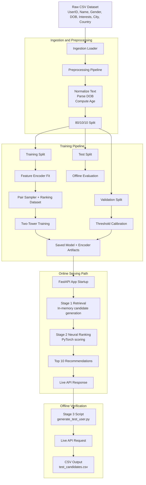
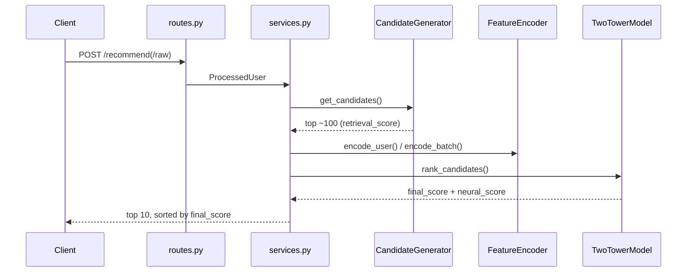

# User Recommendation System

Public GitHub repository: [jayant1554/X_user_recommendation](https://github.com/jayant1554/X_user_recommendation)

This repository implements a two-stage recommendation engine for user-to-user discovery. It is organized as a modular pipeline that supports training, serving, and offline verification.

## Submission Checklist

- Public GitHub repository: [jayant1554/X_user_recommendation](https://github.com/jayant1554/X_user_recommendation)
- Stage 3 output file included in repo: [outputs/test_candidates.csv](outputs/test_candidates.csv)
- README with installation, local API run, and Stage 3 test script instructions
- README with PyTorch model/design explanation, trade-offs, and scaling notes
- README with Stage 4 architecture diagram

## What Is Included

1. Load and normalize raw user data.
2. Retrieve a small candidate pool quickly using in-memory heuristics.
3. Re-rank those candidates with a trained Two-Tower neural model.
4. Expose the pipeline through FastAPI.
5. Verify the live API with an offline integration script that writes CSV output.

The system is designed to work with the dataset schema available in this repo and to be easy to run locally from scratch.

## Project Strengths

- Modular code structure with separate ingestion, preprocessing, retrieval, ranking, API, and testing layers.
- Built-in logging support through the shared logger in [src/utils/logger.py](src/utils/logger.py).
- Clear train/validation/test separation with an 80/10/10 split.
- Fast in-memory retrieval to keep live inference lightweight.
- Saved model and encoder artifacts so the API can load trained assets at startup.
- Offline Stage 3 integration test that exercises the live API instead of bypassing it.
- Submission-ready outputs, including the generated [outputs/test_candidates.csv](outputs/test_candidates.csv) file.

## Installation

**Windows (PowerShell)**

```powershell
git clone https://github.com/jayant1554/X_user_recommendation.git
cd X_user_recommendation
py -m venv venv
.\venv\Scripts\Activate.ps1
pip install -r requirements.txt
```

**macOS / Linux**

```bash
git clone https://github.com/jayant1554/X_user_recommendation.git
cd X_user_recommendation
python3 -m venv venv
source venv/bin/activate
pip install -r requirements.txt
```

## Data Download

The dataset is fetched with the Kaggle helper script.

```bash
python -m scripts.kaggle_download
```

## Train the Model

This step trains the model, evaluates it, and saves artifacts into `models/`.

```bash
python -m src.ranking.train
```

## Run the API Locally

Start the FastAPI server after training.

```bash
uvicorn src.api.main:app --reload
```
and to test use 
`http://127.0.0.1:8000/docs`

The API endpoints are:

- `POST /recommend`
- `POST /recommend/raw`

## Run Stage 3 Offline Verification

The Stage 3 script posts a dummy test user to the live API and writes the result to a CSV file.

```bash
python -m scripts.generate_test_user
```

The output is written to `outputs/test_candidates.csv`.

## Architecture Overview

The diagram below shows the full pipeline from raw data to training, serving, and offline verification.


```mermaid
flowchart TB
	A[Raw CSV Dataset\nUserID, Name, Gender, DOB, Interests, City, Country]

	subgraph INGEST[Ingestion and Preprocessing]
		B[Ingestion Loader]
		C[Preprocessing Pipeline]
		D[Normalize Text\nParse DOB\nCompute Age]
		E[80/10/10 Split]
	end

	subgraph TRAIN[Training Pipeline]
		F[Training Split]
		G[Validation Split]
		H[Test Split]
		I[Feature Encoder Fit]
		J[Pair Sampler + Ranking Dataset]
		K[Two-Tower Training]
		L[Threshold Calibration]
		M[Offline Evaluation]
		N[Saved Model + Encoder Artifacts]
	end

	subgraph SERVE[Online Serving Path]
		O[FastAPI App Startup]
		P[Stage 1 Retrieval\nIn-memory candidate generation]
		Q[Stage 2 Neural Ranking\nPyTorch scoring]
		R[Top 10 Recommendations]
		S[Live API Response]
	end

	subgraph TEST[Offline Verification]
		T[Stage 3 Script\ngenerate_test_user.py]
		U[Live API Request]
		V[CSV Output\ntest_candidates.csv]
	end

	A --> B --> C --> D --> E
	E --> F
	E --> G
	E --> H

	F --> I --> J --> K --> N
	G --> L --> N
	H --> M

	N --> O --> P --> Q --> R --> S
	S --> T --> U --> V
```

## Design Decisions

### Why the Two-Stage Approach Is Valid

The architecture is valid because it mirrors a standard production recommender design:

- Retrieval narrows a large search space into a manageable shortlist.
- Ranking applies a more expensive neural model only to the shortlist.
- The serving layer stays lightweight and stateless.
- Training, validation, and testing are separated with an 80/10/10 split.
- The offline script exercises the real API instead of bypassing it.

This balances quality, latency, and maintainability. A monolithic model that scores every user against every other user would be too slow at scale. A purely heuristic system would be fast but less expressive.

### Stage 1 Retrieval

Stage 1 is a fast, in-memory candidate generator that uses overlapping interests plus geographic overlap from city and country to build a shortlist of up to 100 users.

- File: [src/retrieval/candidate_gen.py](src/retrieval/candidate_gen.py)

This is practical because the retrieval step does not need a heavy neural model to eliminate obviously irrelevant candidates. It is cheap, deterministic, and easy to reason about.

### Stage 2 Neural Ranking

The shortlist is then scored by a PyTorch Two-Tower model. The model encodes the target user and each candidate using interests, gender, country, and age. The final score blends the heuristic retrieval score with the neural affinity score.

- File: [src/ranking/model.py](src/ranking/model.py)

This works well because the neural model only evaluates a reduced candidate pool, which keeps inference efficient while still allowing richer learned interactions than rule-based scoring alone.

### API Layer

FastAPI exposes the recommendation service.

- `POST /recommend` accepts a processed-style payload and returns both the Stage 1 retrieved pool and the final Stage 2 recommendations.
- `POST /recommend/raw` accepts the raw CSV-style payload (matching the dataset's own column names, e.g. `DOB` instead of `age`) and returns only the final recommendations.

At startup, the API loads the saved model and encoder artifacts from disk. Live inference itself stays in memory and does not write to disk.

#### Request Lifecycle


```mermaid
sequenceDiagram
	participant C as Client
	participant R as routes.py
	participant Sv as services.py
	participant Gen as CandidateGenerator
	participant Enc as FeatureEncoder
	participant M as TwoTowerModel

	C->>R: POST /recommend(/raw)
	R->>Sv: ProcessedUser
	Sv->>Gen: get_candidates()
	Gen-->>Sv: top ~100 (retrieval_score)
	Sv->>Enc: encode_user() / encode_batch()
	Sv->>M: rank_candidates()
	M-->>Sv: final_score + neural_score
	Sv-->>C: top 10, sorted by final_score
```

`AppState` (in `dependencies.py`) loads the dataset, retrieval index, model, encoder, and calibrated threshold once at startup, so no request pays that cost.

#### Response Fields

- `retrieval_score` — Stage 1 heuristic score (interest overlap + location match).
- `final_score` — blended score (`0.7 * retrieval_score + 0.3 * neural_score`), used to rank and select the top 10.
- `is_recommended` — whether the raw neural score alone clears the threshold calibrated in training ([src/ranking/train.py](src/ranking/train.py)); independent of `final_score`, so a top-ranked user can still show `is_recommended: false`.

### Offline Verification

The script [scripts/generate_test_user.py](scripts/generate_test_user.py) posts a dummy test user to the live API and writes the target row plus recommendations to a CSV file.

This verifies the actual served API path rather than calling internal functions directly.