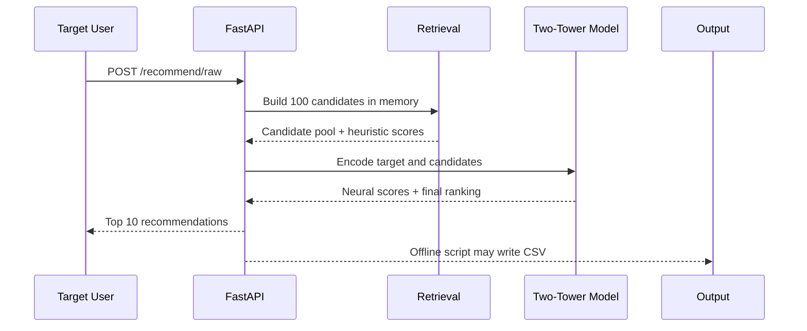

# Repository Architecture and Workflow

## Overview

This repository implements a two-stage user recommendation system:

1. Data ingestion and preprocessing
2. Stage 1 candidate retrieval
3. Stage 2 neural ranking
4. API serving
5. Offline integration testing

The system is trained on an 80/10/10 split and served through a FastAPI endpoint.

## High-Level Architecture

```mermaid
flowchart LR
    A[Raw CSV Dataset\nUserID, Name, Gender, DOB, Interests, City, Country] --> B[Ingestion Loader]
    B --> C[Preprocessing Pipeline]
    C --> D[80/10/10 Split]
    D --> E[Train Split]
    D --> F[Validation Split]
    D --> G[Test Split]

    E --> H[Feature Encoder Fit]
    H --> I[Pair Sampler + Ranking Dataset]
    I --> J[Two-Tower Training]
    F --> K[Threshold Calibration]
    G --> L[Offline Evaluation]

    J --> M[Saved Model + Encoder Artifacts]
    K --> M

    M --> N[FastAPI App Startup]
    N --> O[Stage 1 Retrieval\nIn-memory candidate generation]
    O --> P[Stage 2 Neural Ranking\nPyTorch Two-Tower scoring]
    P --> Q[Top-10 Recommendations]

    Q --> R[Live API Response]
    Q --> S[Offline Integration Script\nwrite CSV output]
```

## Component Breakdown

### 1. Ingestion

- File: [src/ingestion/loader.py](../src/ingestion/loader.py)
- Reads the raw CSV dataset from `data/raw/Assessment_TwitterDataset.csv`
- Parses the `Interests` column into a list
- Produces `User` objects defined in [src/ingestion/schema.py](../src/ingestion/schema.py)

### 2. Preprocessing

- File: [src/preprocessing/pipeline.py](../src/preprocessing/pipeline.py)
- Validates each user
- Parses DOB and computes age
- Normalizes text fields and interests
- Outputs `ProcessedUser` objects

### 3. Dataset Split

- File: [src/ingestion/splitter.py](../src/ingestion/splitter.py)
- Enforces an 80/10/10 train/validation/test split
- Used by the training script so train, validation, and test remain separated

### 4. Retrieval Stage

- File: [src/retrieval/candidate_gen.py](../src/retrieval/candidate_gen.py)
- Runs fully in memory
- Builds candidate pools from overlapping interests and geographic overlap
- Uses a heuristic retrieval score to rank up to 100 candidates

### 5. Neural Ranking Stage

- File: [src/ranking/model.py](../src/ranking/model.py)
- Implements the Two-Tower PyTorch model
- Encodes users using interests, gender, country, and age
- Scores target/candidate pairs and blends neural score with retrieval score
- Returns the final top 10 recommendations

### 6. Model Training

- File: [src/ranking/train.py](../src/ranking/train.py)
- Fits the feature encoder on the training split only
- Builds pairwise training data with positive and negative samples
- Trains the Two-Tower model
- Calibrates the validation threshold
- Saves model and encoder artifacts into `models/`

### 7. API Layer

- Files: [src/api/main.py](../src/api/main.py), [src/api/routes.py](../src/api/routes.py), [src/api/services.py](../src/api/services.py)
- `POST /recommend` accepts processed-style input
- `POST /recommend/raw` accepts the raw CSV-style user payload
- The API loads the dumped model and encoder at startup
- Live inference does not write to disk

### 8. Offline Verification

- File: [scripts/generate_test_user.py](../scripts/generate_test_user.py)
- Sends a dummy test user to the live API
- Uses `requests` to call the running service
- Writes the target row plus recommendations to `outputs/test_candidates.csv`

## Workflow

### Training Workflow

1. Load the raw CSV dataset.
2. Preprocess users and compute age.
3. Split into train, validation, and test sets using 80/10/10.
4. Fit the feature encoder on the train split only.
5. Build ranking pairs and train the Two-Tower model.
6. Calibrate on validation data.
7. Evaluate on test data.
8. Save the model and encoder artifacts.

### Live Recommendation Workflow

1. Client sends a single target user to the API.
2. The API converts input to the processed user form.
3. Stage 1 retrieval builds a 100-candidate pool in memory.
4. Stage 2 ranking scores each candidate with the Two-Tower model.
5. Final top 10 recommendations are returned as JSON.

### Offline Integration Test Workflow

1. Start the API server.
2. Run the offline test script.
3. The script posts a dummy user to the live endpoint.
4. The response is written to a CSV file for inspection.

## Data Flow Summary

## Notes

- The codebase is structured to keep retrieval logic, model logic, and API logic separate.
- Live inference avoids disk I/O.
- The current dataset only provides city and country, so geographic proximity is implemented as same-city and same-country overlap rather than true coordinate distance.